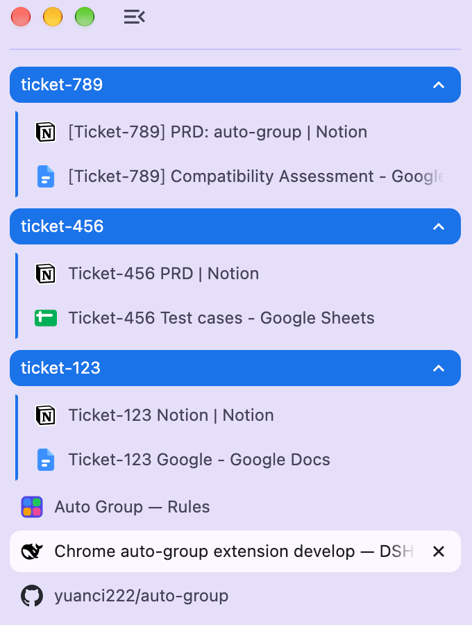

# Auto Group

A Chrome (Manifest V3) extension that groups tabs automatically with regex rules.

Two things set it apart from other tab groupers:

- **One group per matched value.** A single rule in *per-match* mode turns every distinct match
  into its own group — pattern `ticket-\d+` on `document.title` gives `ticket-123`, `ticket-456`
  and `ticket-789` three separate groups.
- **`groups | ungrouped` ordering.** Groups stay contiguous on the left, ungrouped tabs on the
  right, and a new group is inserted after the existing groups and before the first ungrouped tab:

```
GroupA | GroupB | GroupC | ticket-123 | ticket-456 | tabA | tabB
```

Everything runs locally: no host permissions, no content scripts, no network requests.

## Example

Grouping by ticket id — a PRD on Notion, test cases on Google Sheets and a doc on Google Docs all
land in the group for their ticket, and the ungrouped tabs sit below:



## Features

| Requirement | How it works |
| --- | --- |
| **Regex matching** | JavaScript regex with flags, plus `wildcard`, `contains`, `startsWith`, `endsWith`, `exact` and `domain` modes. Match against `document.title`, the URL, or both. Multiple alternative patterns per rule. |
| **Dynamic matching on `document.title`** | A rule in *per-match* mode with pattern `ticket-\d+` creates a distinct group for every matched value. Use a title template (`ticket-$1`) and capture groups / named captures to name the groups. |
| **Import / export, merge on import** | Import auto-detects the file format and **merges** — existing rules are never overwritten and semantic duplicates are skipped. Export as the native JSON, as a Tabee / Tab Modifier config, or as a Markdown table. |
| **Stable tab-strip order** | After grouping, groups are kept contiguous on the left and ungrouped tabs on the right. A newly created `GroupD` lands **after the other groups and before the first ungrouped tab**. Pinned tabs stay first. |

## Install (load the built extension)

```bash
pnpm install
pnpm build          # type-checks, then writes dist/
```

Then in Chrome:

1. Open `chrome://extensions`
2. Enable **Developer mode** (top right)
3. Click **Load unpacked** and choose the `dist/` folder in this repo

Click the toolbar icon for a quick “Run rules on this window”, or open the options page to manage
rules, test patterns, and import/export.

> Chrome's branded builds ignore `--load-extension` on the command line, so the `chrome://extensions`
> flow above (or Chrome for Testing) is the supported way to load it.

## Development

```bash
pnpm dev            # Vite dev server with HMR for the extension pages
pnpm test           # Vitest unit tests (67)
pnpm test:watch     # watch mode
pnpm typecheck      # tsc --noEmit
pnpm e2e            # real-Chrome end-to-end test (needs Chrome for Testing)
pnpm build          # production build into dist/
```

`pnpm e2e` drives a headless Chrome through the DevTools protocol, loads `dist/`, seeds a rule,
opens tabs and asserts the grouping and ordering behaviour. It looks for Chrome for Testing at
`.cache/browsers/...` (install with
`npx @puppeteer/browsers install chrome@stable --path .cache/browsers`) and honours `CHROME_PATH`.

## Import / export compatibility

Import auto-detects the file format and **merges** — existing rules are never overwritten and
semantic duplicates are skipped. Export as native JSON, as a Tabee / Tab Modifier config, or as a
Markdown table.

Supported rule formats include Tab Modifier / Tabee, Simple Tab Groups, Tab Groups Extension,
Auto-Group Tabs (loilo), Auto Tab Groups (nitzanpap), Auto Tab Grouper, Regex Tab Organizer and
Tabs Manager. Session exports from Tab Manager Plus, Tab Session Manager, Session Buddy, Toby,
Workona and Tablerone (plus OneTab text and bookmark HTML) are converted into **disabled** starter
rules for you to review. Format details and field mappings are in
[`docs/DESIGN.md`](docs/DESIGN.md).

## Trademarks & compatibility

This is an independent implementation. To help you migrate, it can read and write file formats
produced by other tab and session managers. It does **not** include, bundle, copy or reuse any of
their source code, icons or artwork — the importers were written from the published formats and
field names, which are functional interoperability details. The automated tests use original
sample data.

Product names such as Tab Modifier, Tabee, Simple Tab Groups, Tab Manager Plus, Tab Session
Manager, Session Buddy, OneTab, Toby, Workona, Tablerone, Tab Groups Extension, Auto-Group Tabs,
Auto Tab Groups, Auto Tab Grouper, Regex Tab Organizer and Tabs Manager are trademarks or product
names of their respective owners. They are used here only to describe format compatibility
(nominative use). This project is not affiliated with, sponsored by or endorsed by any of them.

## Permissions

| Permission | Why |
| --- | --- |
| `tabs` | read tab titles/URLs and move tabs |
| `tabGroups` | create, name and colour groups |
| `storage` | keep your rules locally |

No host permissions, no content scripts, no network access.

## Docs

- [`docs/DESIGN.md`](docs/DESIGN.md) — ecosystem research, format notes and design decisions.

## Credits

Research, design and implementation were produced with **Deepseek Harness** running the
`deepseek-v4.1-flash-expires-on-0910` model.
